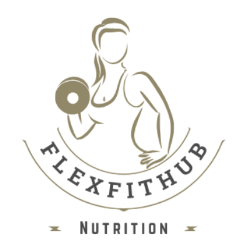

# NutriFlex

<!--  -->

    

Nutri Flex propose des protéines en poudre de qualité, des compléments alimentaires et des barres protéinés conçus pour soutenir les débutants ou athlètes dans leurs objectifs. 

Que ce soit pour prendre de la masse, améliorer les performances ou favoriser la récupération, Nutri Flex offre des solutions adaptées à tous, avec un engagement sur la transparence et l’efficacité.

## Table des matières

1. [Présentation](#présentation)
2. [Installation](#installation)
3. [Licence](#licence)

## Présentation

Ce projet à pour but de permettre à n'importe qui de pouvoir rapidement et facilement s'informer et acheter des produits nutrif adapté pour le sport.

## Installation

Pour intaller et éxecuter le projet il faut d'abord clone le dépôt à partir de ce lien :
https://github.com/rawanatouii/NutriFlex.git

## Licence

Site web développé par Guillaume BERTRAND, Tatiana GOMEZ, Hugo PIEDANNA, Jovis LELUE, Rawan ATOUI.
